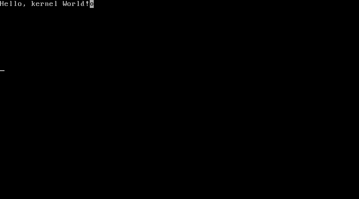

# bare-bones-x86

This is a simple kernel for 32bit x86 using Bios and GRUB to boot into
protected mode. It shows how to setup the stack, call C code and
output a simple text to the VGA text console. See
http://wiki.osdev.org/Bare_bones for help.

| Architecture | Firmware / Bootloader | Tags |
| ------------ | --------------------- | ---- |
| x86 (32bit)  | Bios/GRUB             | VGA  |

# Makefile targets

| Target          |                                                 |
| :-------------- | :---------------------------------------------- |
| all             | build kernel and boot in qemu-system-i386       |
| myos.bin        | build kernel                                    |
| check-multiboot | check if the multiboot header works             |
| myos.iso        | build CDROM/USB boot image with GRUB menu       |
| boot-cdrom      | boot kernel in qemu-system-i386 from boot image |
| boot            | boot kernel directly in qemu-system-i386        |
